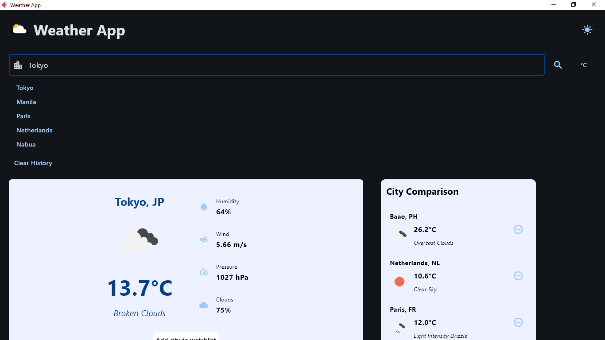
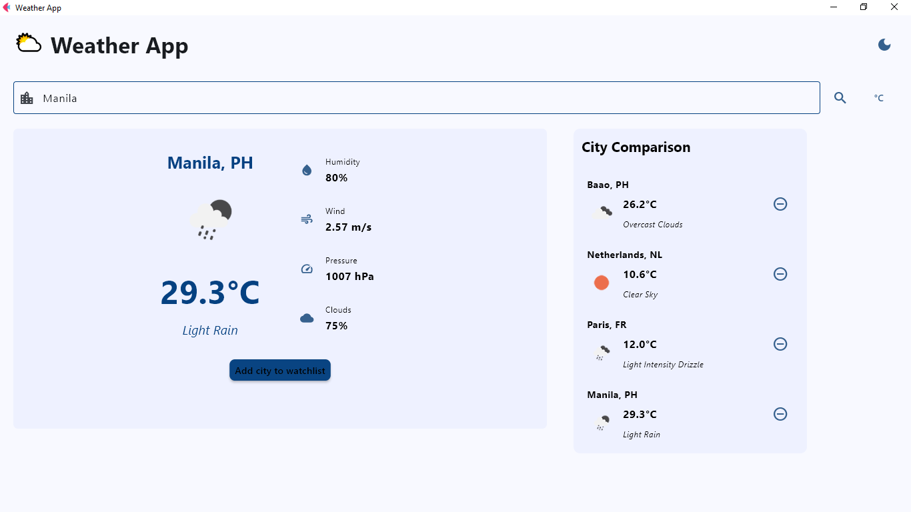
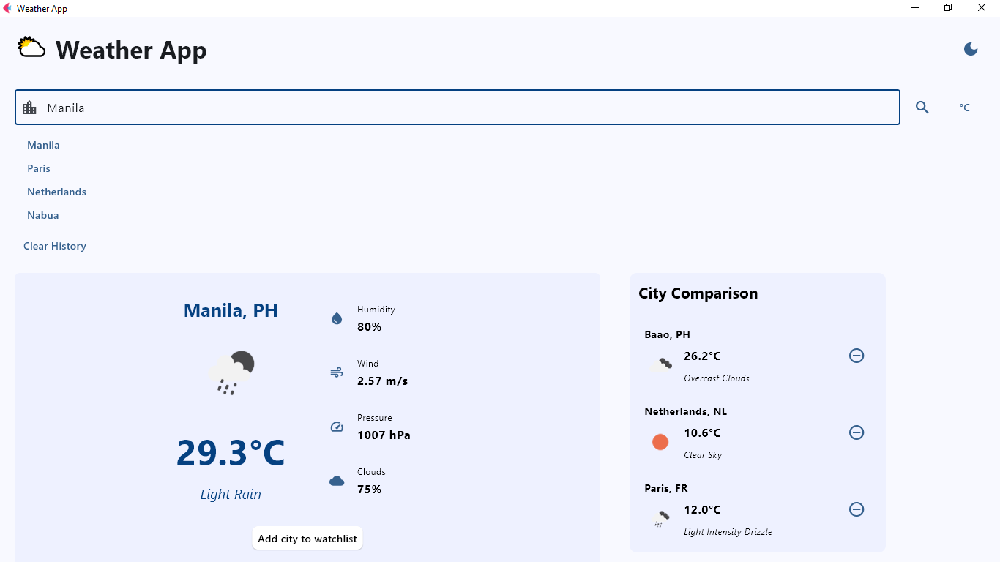
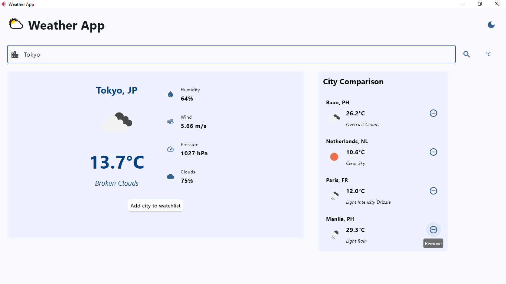
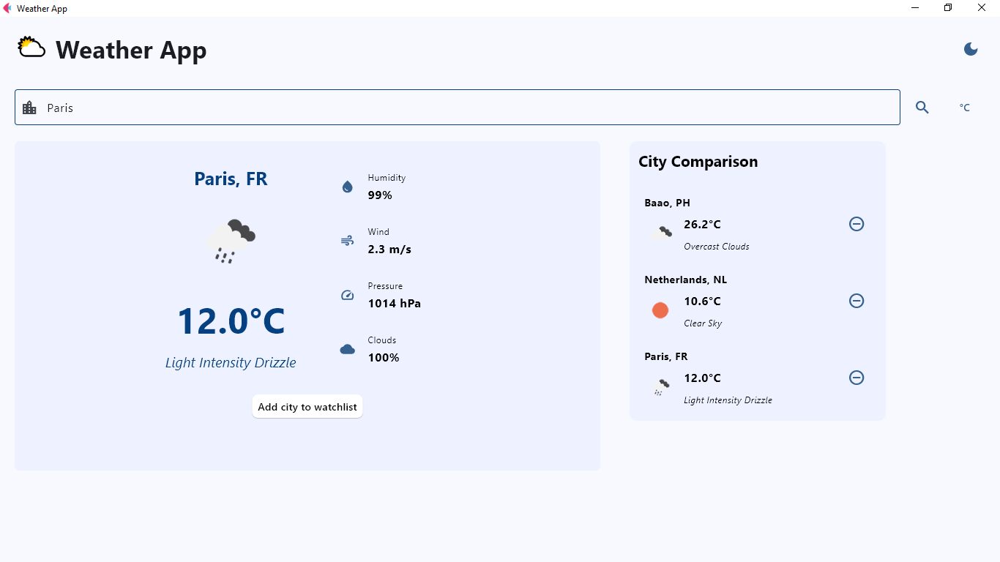

# Weather Application - Module 6 Lab

## Student Information
- **Name**: Arabella Bayta
- **Student ID**: 231004406
- **Course**: CCCS 106
- **Section**: BSCS3B

## Project Overview
This weather app provides current weather information for cities worldwide. It shows temperature, humidity, wind speed, cloud coverage, and a brief description of conditions. The app supports both Celsius and Fahrenheit, remembers recent searches, and allows users to keep a watchlist for quick comparison of multiple cities.

## Features Implemented

### Base Features
- [/] City search functionality
- [/] Display current weather conditions
- [/] Temperature, humidity, and wind speed
- [/] Weather icons
- [/] Handles errors and invalid inputs gracefully
- [/] Modern UI with Material Design

### Enhanced Features
1. **[Dark/Light Theme Toggle]**
   - Allows switching between dark and light modes for comfortable viewing in different lighting conditions.
   - Added to make the interface more comfortable and visually appealing in different lighting conditions.
   - Challenge: Ensuring all UI elements adapt correctly to theme changes. Solved by using Flet’s theme-aware components and dynamically updating colors.

2. **[Search History]**
   - Stores recent city searches and displays them in a dropdown for quick access
   - Chosen to make repeated searches faster and more convenient.
   - Challenge: Keeping the history updated and clickable without interfering with other UI interactions. Solved by updating the dropdown on focus and selection events.

3. **[Watchlist / Multiple Cities Comparison]**
   - Lets users add multiple cities to a watchlist to view their weather side-by-side.
   - Chosen to allow quick comparison of weather conditions across different locations.
   - Challenge: Fetching weather data asynchronously for multiple cities without freezing the UI. Solved using asynchronous tasks in Flet.

4. **[Temperature Unit Toggle (Celsius/Fahrenheit)]**
   - Allows switching between Celsius and Fahrenheit and automatically converts temperatures in the main view and watchlist
   - Chosen to accommodate different user preferences.
   - Challenge: Updating all relevant UI elements in real time. Solved by storing a current_unit variable and refreshing the displays whenever the unit changes.

## Screenshots
#### LIGHTMODE

#### DARKMODE

#### WATCHLIST

#### HISTORY

#### COMPARISON

#### IN CELCIUS

#### IN FAHRENHEIT


## Installation

### Prerequisites
- Python 3.8 or higher
- pip package manager

### Setup Instructions
```bash
# Clone the repository
git clone https://github.com/arabyte-sr/cccs106-projects.git
cd cccs106-projects/mod6_labs

# Create virtual environment
python -m venv venv
source venv/bin/activate  # On Windows: venv\Scripts\activate

# Install dependencies
pip install -r requirements.txt

# Create .env file
cp .env.example .env
# Add your OpenWeatherMap API key to .env
