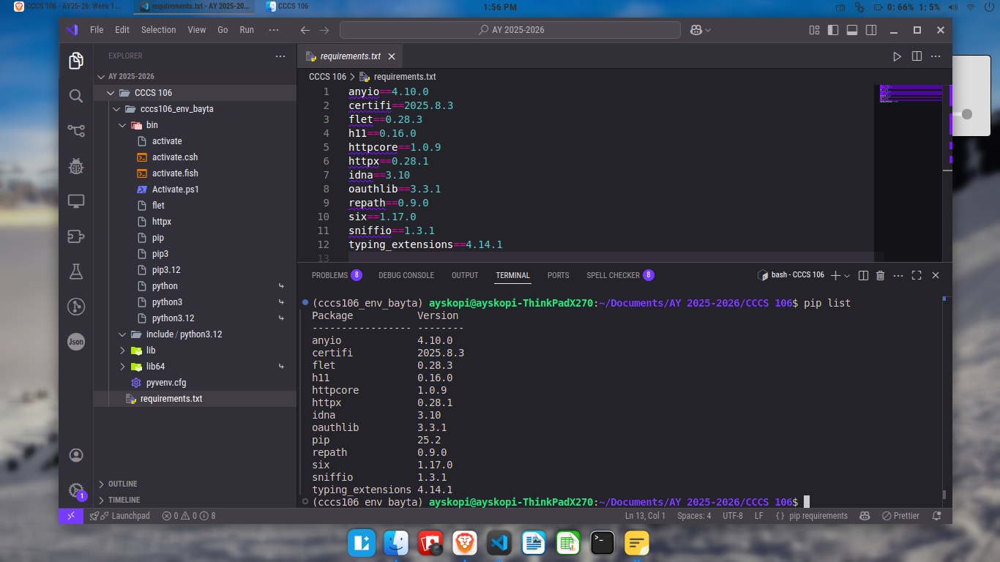
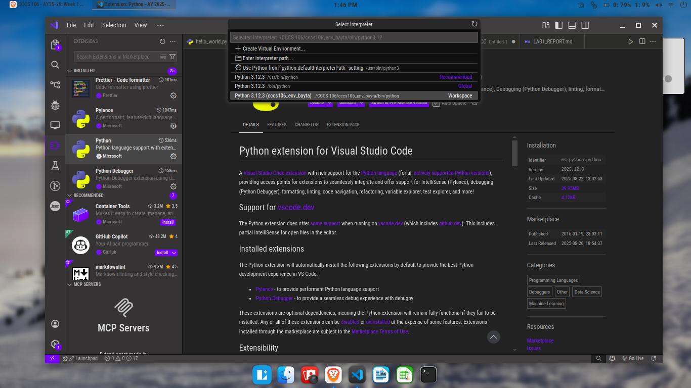
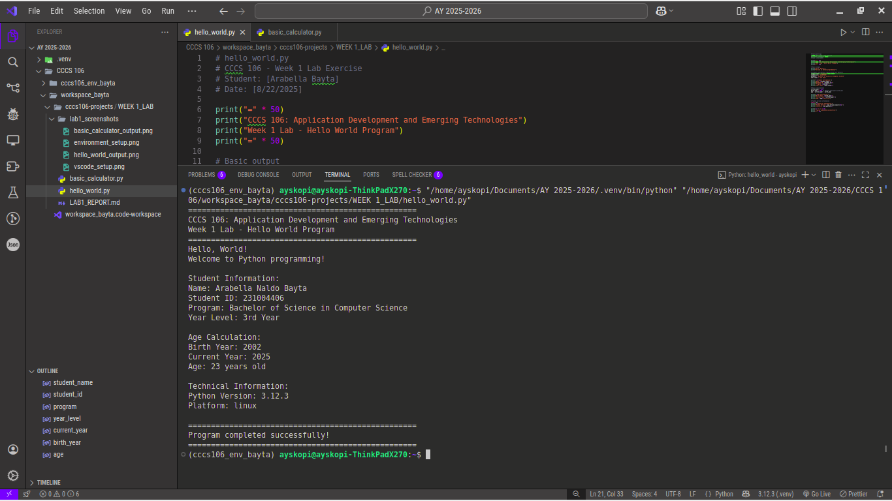
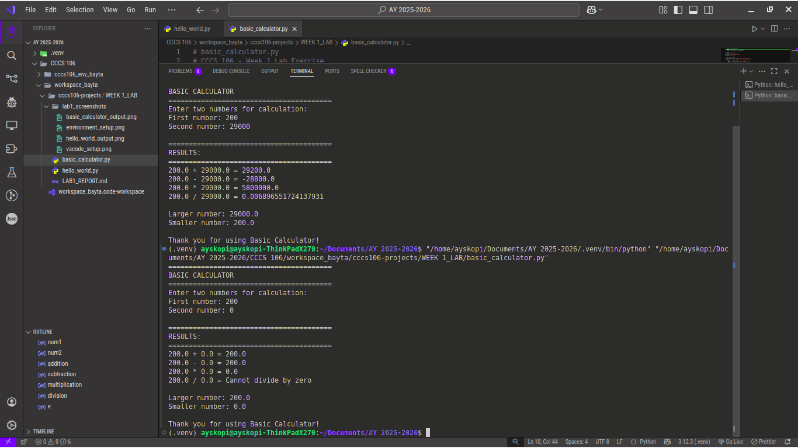

# Lab 1 Report: Environment Setup and Python Basics

**Student Name:** Arabella Bayta
**Student ID:** 231004406
**Section:** BSCS 3B
**Date:** 8/27/25

## Environment Setup

### Python Installation
- **Python Version:** [3.12.3]
- **Installation Issues:** [None]
- **Virtual Environment Created:** ✅ cccs106_env_bayta

### VS Code Configuration
- **VS Code Version:** [1.102.1]
- **Python Extension:** ✅ Installed and configured
- **Interpreter:** ✅ Set to cccs106_env_bayta/bin/python3

### Package Installation
- **Flet Version:** 0.28.3
- **Other Packages:** anyio==4.10.0\
certifi==2025.8.3\
flet==0.28.3\
h11==0.16.0\
httpcore==1.0.9\
httpx==0.28.1\
idna==3.10\
anyio==4.10.0\
certifi==2025.8.3\
flet==0.28.3\
h11==0.16.0\
httpcore==1.0.9\
httpx==0.28.1\
idna==3.10\
oauthlib==3.3.1\
repath==0.9.0\
six==1.17.0\
sniffio==1.3.1\
typing_extensions==4.14.1\
oauthlib==3.3.1\
repath==0.9.0\
six==1.17.0\
sniffio==1.3.1\
typing_extensions==4.14.1

## Programs Created

### 1. hello_world.py
- **Status:** ✅ Completed
- **Features:** Student info display, age calculation, system info
- **Notes:** The program displays correct information as expected.

### 2. basic_calculator.py
- **Status:** ✅ Completed
- **Features:** Basic arithmetic, error handling, min/max calculation
- **Notes:** The program handles errors, such as dividing by zero, and prevents the program from crashing.

## Learning Outcomes

Setting up a virtual environment (cccs106_env_bayta) will be helpful in future projects and lab activities, as it creates an isolated space for the project’s Python packages. This keeps them separate from other projects and avoids conflicts when different projects need different package versions. Using the correct interpreter in VS Code ensured that programs ran in the right environment. Working on hello_world.py and basic_calculator.py helped practice Python basics such as syntax, data types, arithmetic operations, and simple logic. So far, no problems were encountered, everything worked as expected, and the programs ran smoothly

## SCREENSHOTS

