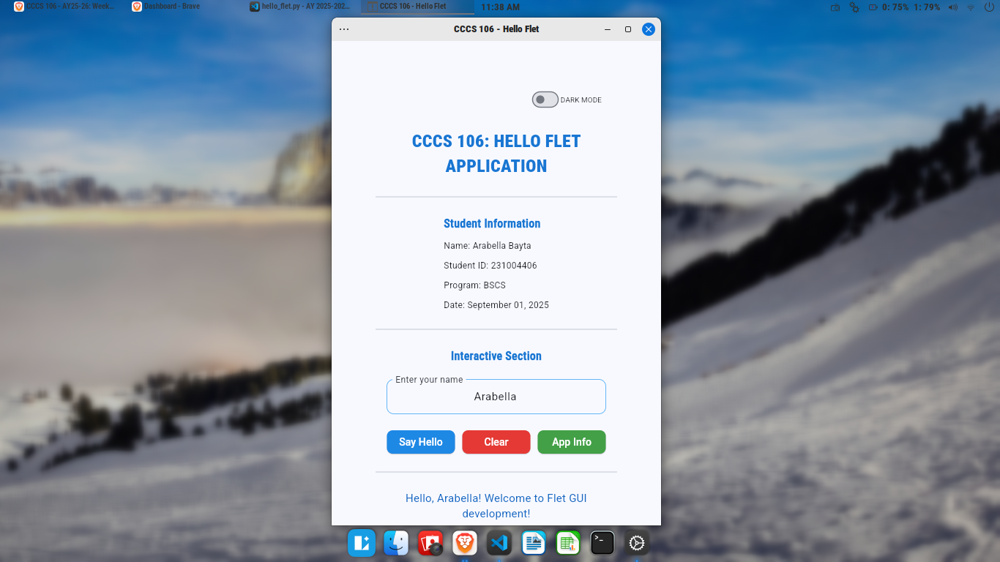
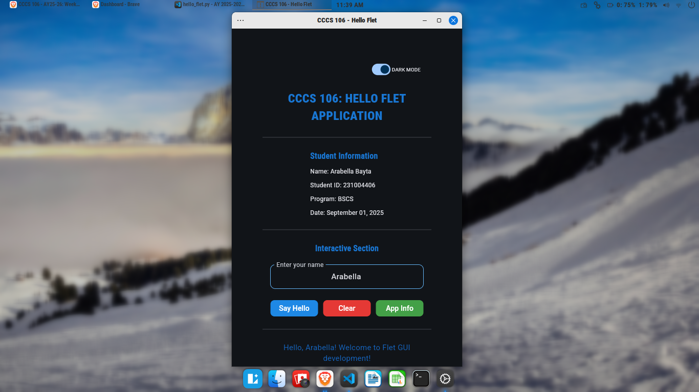
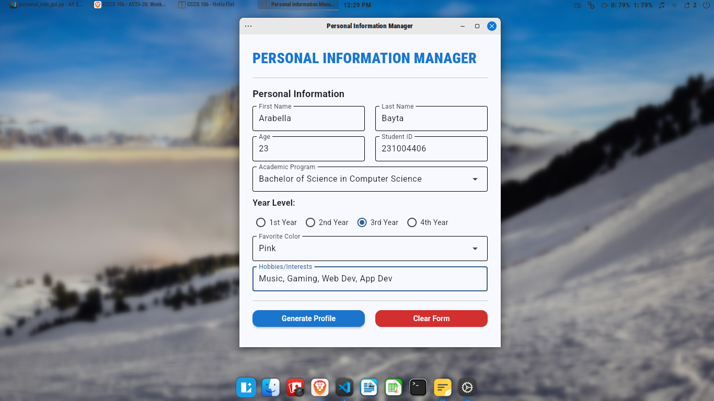
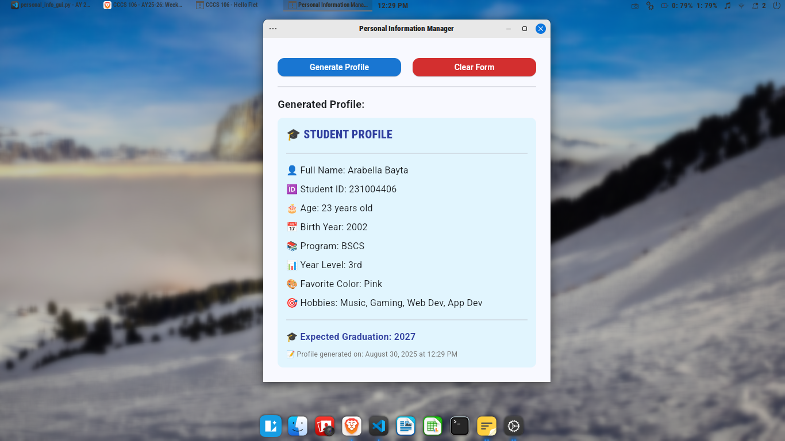

# Lab 2 Report: Git Version Control and Flet GUI Development

**Student Name:** Arabella Bayta\
**Student ID:** 231004406\
**Section:** BSCS 3B\
**Date:** September 3, 2025

## Git Configuration

### Repository Setup
- **GitHub Repository:** https://github.com/arabyte-src/cccs106-projects.git
- **Local Repository:** ✅ Initialized and connected
- **Commit History:** 2 commits with descriptive messages
### Git Skills Demonstrated
- ✅ Repository initialization and configuration
- ✅ Adding, committing, and pushing changes
- ✅ Branch creation and merging
- ✅ Remote repository management

## Flet GUI Applications

### 1. hello_flet.py
- **Status:** ✅ Completed
- **Features:** Interactive greeting, student info display, dialog boxes, light/darkmode toggle.
- **UI Components:** Text, TextField, Buttons, Dialog, Containers, Switch (for theme toggle).
- **Notes:** The dialog shows properly when using page.open(dialog), but the longer manual way didn’t work. I learned that the shortcut is the easiest and most reliable method.

### 2. personal_info_gui.py
- **Status:** ✅ Completed
- **Features:** Form inputs, dropdowns, radio buttons, profile generation
- **UI Components:** TextField, Dropdown, RadioGroup, Containers, Scrolling
- **Error Handling:** Input validation and user feedback
- **Notes:** Arranging the form elements neatly was challenging, especially with different input types.

## Technical Skills Developed

### Git Version Control
- Understanding of repository concepts
- Basic Git workflow (add, commit, push)
- Branch management and merging
- Remote repository collaboration

### Flet GUI Development
- Flet 0.28.3 syntax and components
- Page configuration and layout management
- Event handling and user interaction
- Modern UI design principles

## Challenges and Solutions

One difficulty I encountered was that GitHub no longer supports password authentication for Git operations. When I tried to push my repository, I received an “Invalid username or token” error. I solved this by generating a Personal Access Token (PAT) from GitHub and using it in place of my password. After updating my credentials, I was able to push my project successfully.

## Learning Outcomes

I learned how to use Git to keep track of changes and save my work to GitHub. I also created GUI applications with Flet that respond to user input. Working with branches and merges showed me how to add new features without breaking my project. Overall, I now have a better understanding of version control and building interactive programs.

## Screenshots

### Git Repository
- GitHub repository with commit history

- Local git log showing commits

### GUI Applications
#### hello_flet.py running with all features

#### personal_info_gui.py with filled form and generated profile

## Future Enhancements

Making the app responsive will ensure it works well on desktops, tablets, and phones. The design can also be enhanced with a clean and modern interface to make it easier and more enjoyable to use.